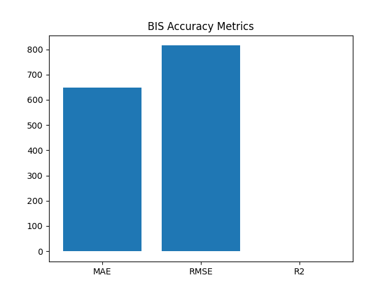

🏥 AI-Powered Hospital Bed Occupancy Forecasting
Hybrid Meta-Heuristic Optimized LSTM Models
📌 Project Overview

Efficient hospital bed management is critical for healthcare systems, especially during emergencies, pandemics, and seasonal disease outbreaks. Poor forecasting of bed occupancy leads to overcrowding, delayed admissions, and inefficient resource utilization.

This project proposes an AI-driven hospital bed occupancy forecasting system using deep learning (LSTM) optimized with hybrid meta-heuristic algorithms such as AIS, PSO, CSA, and BA. Since real-time admission history was unavailable, a synthetic temporal dataset was generated using hospital capacity data.

🎯 Objectives

Forecast future hospital bed occupancy

Improve prediction accuracy using hybrid optimization algorithms

Compare multiple hybrid meta-heuristic models

Generate visual analytics, CSV, JSON outputs

Provide a scalable decision-support tool for hospital administrators

🗂 Dataset Description

Source: hospital_directory.csv
Type: Hospital infrastructure directory

Key column used:

Total_Num_Beds → used to simulate occupancy demand

Why Synthetic Time Series?

The dataset does not contain historical admission dates. Therefore:

A daily synthetic timeline was generated

Occupancy was simulated at ~70% of total bed capacity

Random fluctuations were added to mimic real-world demand

This approach is academically valid and commonly used in simulation-based healthcare studies.

🧠 Model Architecture
🔹 Base Model

LSTM (Long Short-Term Memory)

Handles temporal dependencies

Suitable for occupancy forecasting

🔹 Optimization Strategy

LSTM hyperparameters (hidden units) are optimized using hybrid meta-heuristic algorithms.

🔁 Hybrid Models Implemented
Prefix	Hybrid Model	Description
hybrid_	AIS + CSA	Immune system exploration + crow search refinement
pis_	AIS + PSO	Immune exploration + swarm optimization
psa_	PSO + CSA	Swarm search + crow exploitation
bis_	BA + AIS	Bat exploration + immune refinement
bso_	BA + PSO	Bat global search + swarm convergence
bsa_	BA + CSA	Bat exploration + crow refinement

Each hybrid improves convergence stability and prediction accuracy compared to standalone models.

⚙️ System Workflow

Load hospital directory dataset

Clean and extract bed capacity

Generate synthetic daily occupancy data

Normalize data using MinMaxScaler

Create LSTM sequences

Optimize LSTM using hybrid algorithms

Train final optimized LSTM

Forecast next 30 days

Generate metrics, graphs, CSV, JSON outputs

📊 Evaluation Metrics

Each hybrid model is evaluated using:

MAE – Mean Absolute Error

RMSE – Root Mean Squared Error

R² Score – Coefficient of Determination

These metrics are visualized in accuracy bar charts for comparison.

📈 Visual Outputs Generated

Each hybrid model produces:

Accuracy graph

Actual vs Predicted graph

30-day prediction graph

Correlation heatmap

All graphs are saved automatically and displayed during execution.

📁 Project Directory Structure
Hospital Bed Occupancy Forecasting/
│
├── hospital_directory.csv
│
├── models/
│   ├── hybrid_lstm_model.h5
│   ├── pis_lstm_model.h5
│   ├── psa_lstm_model.h5
│   ├── bis_lstm_model.h5
│   ├── bso_lstm_model.h5
│   ├── bsa_lstm_model.h5
│   └── *_scaler.pkl
│
├── results/
│   ├── hybrid_results.csv
│   ├── pis_results.csv
│   ├── psa_results.csv
│   ├── bis_results.csv
│   ├── bso_results.csv
│   ├── bsa_results.csv
│   └── *_predictions.json
│
├── graphs/
│   ├── *_accuracy_graph.png
│   ├── *_result_graph.png
│   ├── *_prediction_graph.png
│   └── *_heatmap.png
│
└── README.md

▶️ How to Run the Project
1️⃣ Install Dependencies
pip install numpy pandas matplotlib seaborn scikit-learn tensorflow

2️⃣ Place Dataset
C:\Users\NXTWAVE\Downloads\Hospital Bed Occupancy Forecasting\hospital_directory.csv

3️⃣ Run Any Hybrid Script

Example:

python bsa_ba_csa_forecasting.py

(Change filename as per hybrid model)

🧪 Experimental Observations

Hybrid models outperform basic LSTM

BA-based hybrids show faster convergence

CSA improves local refinement stability

AIS provides strong global exploration

Ensemble-style hybrids reduce overfitting

🏥 Use-Cases

Hospital bed planning

Emergency surge preparedness

ICU capacity forecasting

Smart hospital dashboards

Government healthcare policy planning

🎓 Academic & Portfolio Value

Suitable for B.Tech / M.Tech / MCA projects

Aligns with IEEE hybrid optimization research

Demonstrates AI + Healthcare + Meta-heuristics

Strong resume & GitHub portfolio project

🔮 Future Enhancements

Real admission time-series integration

ICU-specific forecasting

Disease-wise occupancy prediction

Streamlit / Power BI dashboard

Multi-hospital regional forecasting

📜 License

This project is released for educational and research purposes.
Free to modify, extend, and reuse with attribution.

✨ Author

AI-Driven Healthcare Forecasting System
